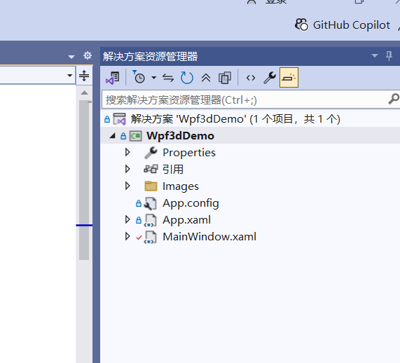

# 1.创建一个wpf 项目（.net framework)起名：Wpf3dDemo，然后新建一个Images文件夹，放入一些图片，注意需要在Images文件夹上面点击右键—》添加-》现有项，然后选择需要的图片添加进来




# 2.在MainWindow.xaml里面定义一个StackPanel作为资源，下面的VisualBrush会用到这个资源

```
...
 <Window.Resources>
     <StackPanel x:Key="VisualBackgroud" Orientation="Horizontal">
         <Image Source="/Images/bronze.png" Width="120" Height="50" />
         <Image Source="/Images/gold.png" Width="120" Height="50" />
         <Image Source="/Images/plate.png" Width="120" Height="50" />
         <Image Source="/Images/silver.png" Width="120" Height="50" />
     </StackPanel>
 </Window.Resources>
 ...
```

# 3.然后编写绘制3D立方体的代码，使用上面的资源来填充立方体.代码如下

```
...
 <DockPanel>
     <Viewport3D>
         <Viewport3D.Camera>
             <PerspectiveCamera LookDirection="-0.75,-0.8,-1"
                                Position="3.8,4,4" FieldOfView="17"
                                UpDirection="0,1,0"></PerspectiveCamera>
         </Viewport3D.Camera>
         <ModelVisual3D>
             <ModelVisual3D.Content>
                 <Model3DGroup>
                     <PointLight Position="3.8,4,4" Color="White" Range="7" ConstantAttenuation="1.0" />
                     <GeometryModel3D>
                         <GeometryModel3D.Geometry>
                             <MeshGeometry3D TextureCoordinates="0,0 1,0 0,-1 1,-1 0,0 1,0 0,-1 0,0"
                                             Positions="0,0,0 1,0,0 0,1,0 1,1,0 0,1,-1 1,1,-1 1,1,-1 1,0,-1"
                                             TriangleIndices="0,1,2 3,2,1 4,2,3 5,4,3 6,3,1 7,6,1"/>
                         </GeometryModel3D.Geometry>
                         <GeometryModel3D.Material>
                             <DiffuseMaterial>
                                 <DiffuseMaterial.Brush>
                                     <VisualBrush Visual="{StaticResource VisualBackgroud}" 
                                      TileMode="Tile" 
                                      Viewport="0,0,0.4,0.1" 
                                      />
                                 </DiffuseMaterial.Brush>
                             </DiffuseMaterial>
                         </GeometryModel3D.Material>
                         <GeometryModel3D.Transform>
                             <RotateTransform3D CenterX="0.5" CenterY="0.5" CenterZ="-0.5">
                                 <RotateTransform3D.Rotation>
                                     <AxisAngleRotation3D  x:Name="rotation"
                                               Axis="0 1 0" Angle="0">
                                         
                                     </AxisAngleRotation3D>
                                 </RotateTransform3D.Rotation>
                             </RotateTransform3D>
                         </GeometryModel3D.Transform>
                     </GeometryModel3D>
                 </Model3DGroup>
             </ModelVisual3D.Content>
         </ModelVisual3D>
     </Viewport3D>
 </DockPanel>
...
```

# 4.完成绘制后，我们需要让立方体动起来，我们给Window添加一个触发器，触发条件就是当窗口加载完成

```
...
<Window.Triggers>
    <EventTrigger RoutedEvent="FrameworkElement.Loaded">
        <EventTrigger.Actions>
            <BeginStoryboard>
                <Storyboard>
                    <DoubleAnimation 
                        From="-30" To="30" Storyboard.TargetName="rotation"
                        Storyboard.TargetProperty="Angle" 
                        AutoReverse="True" Duration="0:0:3"
                        RepeatBehavior="Forever" />
                </Storyboard>
            </BeginStoryboard>
        </EventTrigger.Actions>
    </EventTrigger>
</Window.Triggers>
...
```

# 5.MainWindow.xaml完整的代码如下

```
<Window x:Class="Wpf3dDemo.MainWindow"
        xmlns="http://schemas.microsoft.com/winfx/2006/xaml/presentation"
        xmlns:x="http://schemas.microsoft.com/winfx/2006/xaml"
        xmlns:d="http://schemas.microsoft.com/expression/blend/2008"
        xmlns:mc="http://schemas.openxmlformats.org/markup-compatibility/2006"
        xmlns:local="clr-namespace:Wpf3dDemo"
        mc:Ignorable="d"
        Title="MainWindow" Height="480" Width="525">
    <Window.Resources>
        <StackPanel x:Key="VisualBackgroud" Orientation="Horizontal">
            <Image Source="/Images/bronze.png" Width="120" Height="50" />
            <Image Source="/Images/gold.png" Width="120" Height="50" />
            <Image Source="/Images/plate.png" Width="120" Height="50" />
            <Image Source="/Images/silver.png" Width="120" Height="50" />
        </StackPanel>
    </Window.Resources>
    <Window.Triggers>
        <EventTrigger RoutedEvent="FrameworkElement.Loaded">
            <EventTrigger.Actions>
                <BeginStoryboard>
                    <Storyboard>
                        <DoubleAnimation 
                            From="-30" To="30" Storyboard.TargetName="rotation"
                            Storyboard.TargetProperty="Angle" 
                            AutoReverse="True" Duration="0:0:3"
                            RepeatBehavior="Forever" />
                    </Storyboard>
                </BeginStoryboard>
            </EventTrigger.Actions>
        </EventTrigger>
    </Window.Triggers>
    <DockPanel>
        <Viewport3D>
            <Viewport3D.Camera>
                <PerspectiveCamera LookDirection="-0.75,-0.8,-1"
                                   Position="3.8,4,4" FieldOfView="17"
                                   UpDirection="0,1,0"></PerspectiveCamera>
            </Viewport3D.Camera>
            <ModelVisual3D>
                <ModelVisual3D.Content>
                    <Model3DGroup>
                        <PointLight Position="3.8,4,4" Color="White" Range="7" ConstantAttenuation="1.0" />
                        <GeometryModel3D>
                            <GeometryModel3D.Geometry>
                                <MeshGeometry3D TextureCoordinates="0,0 1,0 0,-1 1,-1 0,0 1,0 0,-1 0,0"
                                                Positions="0,0,0 1,0,0 0,1,0 1,1,0 0,1,-1 1,1,-1 1,1,-1 1,0,-1"
                                                TriangleIndices="0,1,2 3,2,1 4,2,3 5,4,3 6,3,1 7,6,1"/>
                            </GeometryModel3D.Geometry>
                            <GeometryModel3D.Material>
                                <DiffuseMaterial>
                                    <DiffuseMaterial.Brush>
                                        <VisualBrush Visual="{StaticResource VisualBackgroud}" 
                                         TileMode="Tile" 
                                         Viewport="0,0,0.4,0.1" 
                                         />
                                    </DiffuseMaterial.Brush>
                                </DiffuseMaterial>
                            </GeometryModel3D.Material>
                            <GeometryModel3D.Transform>
                                <RotateTransform3D CenterX="0.5" CenterY="0.5" CenterZ="-0.5">
                                    <RotateTransform3D.Rotation>
                                        <AxisAngleRotation3D  x:Name="rotation"
                                                  Axis="0 1 0" Angle="0">
                                            
                                        </AxisAngleRotation3D>
                                    </RotateTransform3D.Rotation>
                                </RotateTransform3D>
                            </GeometryModel3D.Transform>
                        </GeometryModel3D>
                    </Model3DGroup>
                </ModelVisual3D.Content>
            </ModelVisual3D>
            
            
        </Viewport3D>
    </DockPanel>
</Window>

```

## MainWindow.xaml.cs的代码没有修改

```
using System.Windows;

namespace Wpf3dDemo
{
    /// <summary>
    /// MainWindow.xaml 的交互逻辑
    /// </summary>
    public partial class MainWindow : Window
    {
        public MainWindow()
        {
            InitializeComponent();
        }
    }
}

```


